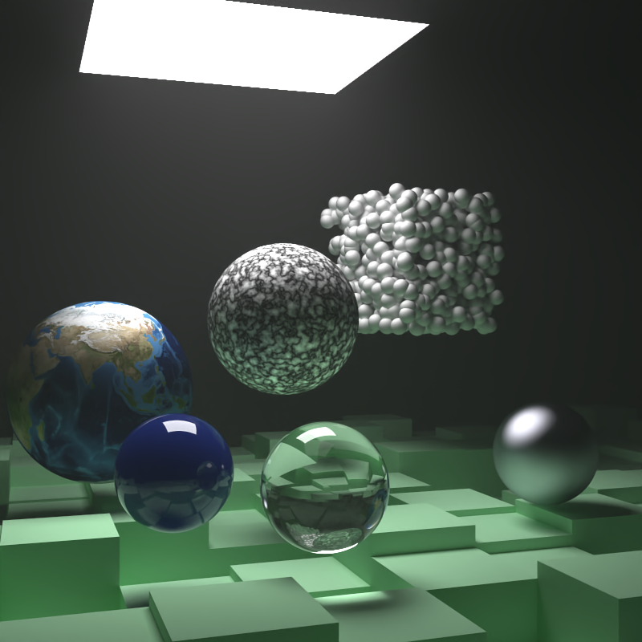

# Rustracer - A Path Tracer Written In Rust

<p align="center">
  
</p>

This is a basic ray / path tracer written in rust. It is based off of
the book *Ray Tracing in One Weekend* by Peter Shirley, [available here](https://www.amazon.com/Ray-Tracing-Weekend-Minibooks-Book-ebook/dp/B01B5AODD8/ref=sr_1_1?crid=2M1LIGDUSI1DY&keywords=ray+tracing+in+one+weekend&qid=1554232233&s=gateway&sprefix=ray+tracing+in+%2Caps%2C209&sr=8-1).

This repo follows all the way through book two, with the exception that
moving spheres were removed.

## Usage

```bash
cargo run --release > rttnw_final_scene2.png
```

## Performace

This section is based off the first book in the series and applies to the v1.1.1
tag only.

**v1.1.1 (Multi Threaded):**

After adding support for multi-threading, rustrace is now super *duper* fast.

Benchmarks:

Computer Info:
- macOS 10.14.3 (18D109)
- MacBook Pro (15-inch, 2018)
- 2.6 GHz Intel Core i7
- 16 GB 2400 MHz DDR4

Rustracer:
- Took 19.57 seconds.
- Run using `cargo run --release > image.ppm` (Time above subtracts 0.86s build time)

Reference:
- Took 58.051 seconds.
- Built using `g++ -O3 main.cc -o main`

This is an unfair comparison now though because the reference implementation is
single threaded.

**v1.0.0 (Single Threaded):**

Interestingly this implementation is slightly faster than the [C++ reference version](https://github.com/petershirley/raytracinginoneweekend).
By slightly I mean *very* slightly, they are within seconds of each other.

Benchmarks:

Computer Info:
- macOS 10.14.3 (18D109)
- MacBook Pro (15-inch, 2018)
- 2.6 GHz Intel Core i7
- 16 GB 2400 MHz DDR4

Rustracer:
- Took 56.091 seconds.
- Run using `cargo run --release > image.ppm` (Time above subtracts 0.79s build time)

Reference:
- Took 58.051 seconds.
- Built using `g++ -O3 main.cc -o main`

Both programs are single threaded.
